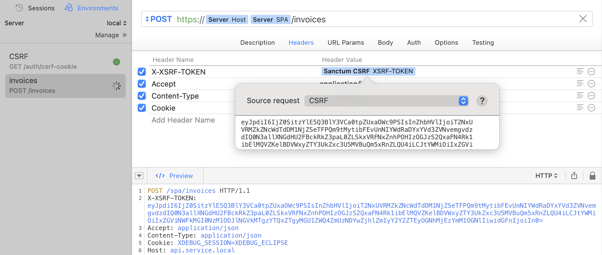

# Sanctum CSRF Token for Laravel

[](https://github.com/andrunio/sanctum-csrf-token-for-laravel/actions/workflows/ci.yml)
[](https://codecov.io/gh/andrunio/sanctum-csrf-token-for-laravel)
[](https://github.com/andrunio/sanctum-csrf-token-for-laravel/releases/latest)

A Dynamic Value extension for [RapidAPI for Mac](https://paw.cloud) (formerly Paw). It reads the
`XSRF-TOKEN` cookie, URL-decodes it and returns the token for the `X-XSRF-TOKEN` header.



## Why

Laravel Sanctum's SPA authentication is cookie-based and CSRF-protected:

1. The client calls `GET /sanctum/csrf-cookie`. Sanctum answers with an `XSRF-TOKEN` cookie whose
   value is **URL-encoded**.
2. Every state-changing request must send that value back, **decoded**, in the `X-XSRF-TOKEN` header.
   Laravel answers `419 CSRF token mismatch` when it does not match the session token.

A browser library such as Axios does step 2 on its own. In an API client the header is filled by hand,
and the token changes with every session. This extension fills it at request time.

## Requirements

RapidAPI for Mac 4.x (or any Paw 3.x build) on macOS.

## Installation

1. Download `com.andrunio.SanctumCsrfTokenForLaravel.zip` from the
   [latest release](https://github.com/andrunio/sanctum-csrf-token-for-laravel/releases/latest).
2. Open **Preferences ‣ Extensions ‣ Open Extensions Directory**.
3. Unzip the archive there and restart the app.

The archive already has the layout the app expects — a folder named after the extension identifier,
holding a `.js` file named after the identifier's last component:

```
Extensions/
  com.andrunio.SanctumCsrfTokenForLaravel/
    SanctumCsrfTokenForLaravel.js
```

From a clone, create that folder by hand and copy `SanctumCsrfTokenForLaravel.js` into it.

## Usage

1. Create a request for `GET /sanctum/csrf-cookie` and send it once. The app keeps the cookies it
   returns and replays them on later requests to the same domain.
2. In the request that needs CSRF protection, add a header named `X-XSRF-TOKEN`.
3. Right-click the header's value field and choose **Extensions ‣ Sanctum CSRF Token for Laravel**.

The token is resolved every time the request is sent, so a refreshed session needs no edits.

## Where the token comes from

The dynamic value has one field, **Source request** — a picker listing the project's requests.

**Current Request**, the default, parses the `Cookie` header this request is about to send.

**Any other request** parses the `Set-Cookie` header of that request's last response. Point it at the
request from step 1; the value stays empty until that request has been sent.

Pick a source request when the request writes its own `Cookie` header — an `XDEBUG_SESSION` cookie,
for instance. An explicit `Cookie` replaces the cookies the app would send from its own store,
`XSRF-TOKEN` is not among them, and **Current Request** has nothing left to read.

An empty value means no `XSRF-TOKEN` was found, and Laravel rejects the request with `419`.

## Laravel side

The token is only issued and accepted when the API treats the client as stateful:

- the client's domain is listed in `SANCTUM_STATEFUL_DOMAINS` (`config/sanctum.php`);
- `supports_credentials` is `true` in `config/cors.php`;
- SPA and API share a common top-level domain, so the cookie is sent along.

## Without this extension

The same value can be assembled from three dynamic values, the officially documented route for pulling
a CSRF token out of a response (RegExp Match is an official extension, not a built-in):

**Response Header** (`Set-Cookie` of the `/sanctum/csrf-cookie` request) → **RegExp Match**
(`XSRF-TOKEN=([^;]+)`, capture group 1) → **URL Encoding** in *Decode* mode.

That chain has to be rebuilt in every header field and always points at a source request. This
extension is a single value, and by default reads the request it sits in.

## Development

The `.js` file is the shipped artifact and is loaded verbatim, so there is no build step. Checks:

```
node --check SanctumCsrfTokenForLaravel.js
node --test
node --test --experimental-test-coverage
```

They cover both sources of the token, the input the extension declares and the static fields the host
requires. CI runs them on every push and fails when coverage of the shipped file falls below 100% of
lines, branches and functions; pushing a `v*` tag packages the extension folder and publishes it as a
release.

## License

MIT — see [LICENSE](LICENSE).
